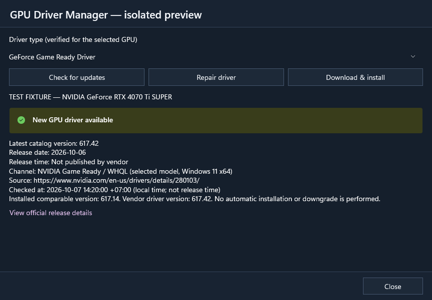
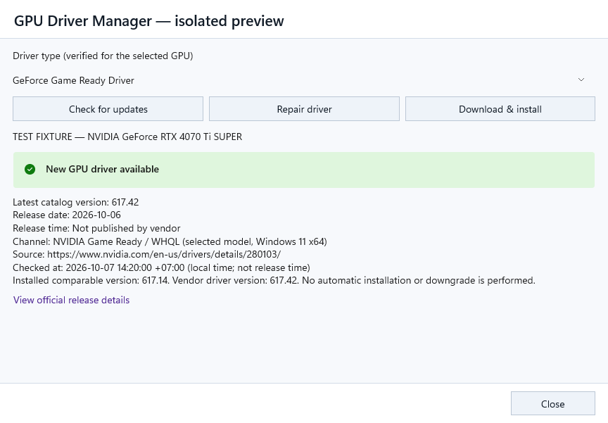

# Naufal Windows Utility

[](CHANGELOG.md)
[](https://github.com/mnaufalalauddin/Naufal-Windows-Utility/releases/tag/v8.0.0.0-build.20261008)
[](#quick-start)
[](LICENSE)
[](#interface--project-status)

A native Windows dashboard to **repair system components**, **inspect disk health and system information**, **manage Windows apps**, **review privacy settings**, and **configure gaming and performance options**—with live monitoring and operation progress in one place.

Developed by **Muhammad Naufal Alauddin**. Independent, open-source, and under active development. **Not affiliated with Microsoft or Microsoft PowerToys.**

**[Download installer](https://github.com/mnaufalalauddin/Naufal-Windows-Utility/releases/tag/v8.0.0.0-build.20261008)** · [Features](#whats-included) · [GPU drivers](#gpu-driver-release-notifications) · [Build from source](#build--develop) · [Changelog](CHANGELOG.md)

> **8 October 2026 — GPU Driver & Header Preview**
> Check official driver releases, choose a GPU-compatible driver type, and use
> Check for updates / Repair driver / Download & install from one shared header.
> NVIDIA versions now use their public format, such as **617.14**. The main
> About / Task Monitoring / Exit header also stays inside every sidebar page.
> This is a **pre-release**: hardware coverage is still being validated, and
> checking for updates never installs a driver automatically.

## Preview

### Dark Mode


### Light Mode

<details>
<summary>View the Light Mode dashboard</summary>


</details>

*Light and Dark screenshots supplied by the maintainer on 28 September 2026 at 01:29. Home shows About, Task Monitoring, and Exit; restart-sensitive changes instead offer “Restart now” or “Later” after active tasks finish. Profile and system-status values reflect the PC when captured, not recommended settings or guaranteed results. Scroll Home for quick actions, telemetry, and technical details.*

### GPU Driver Manager — new shared header



<details>
<summary>View the GPU header in Light Mode</summary>



</details>

*These GPU previews were rendered by the native, backend-free UI test host on
7 October. They show the real header/result components with synthetic release
data; they are not live update results or a screenshot of the complete inventory.*

---

## Quick Start

> **Back up important data before applying tweaks.** System-changing operations may require Administrator privileges. Review each option's warning; do not apply every tweak indiscriminately.

1. Open the [8 October development preview](https://github.com/mnaufalalauddin/Naufal-Windows-Utility/releases/tag/v8.0.0.0-build.20261008) and download `Naufal-Windows-Utility-Setup-8.0.0.0-x64.exe`. Compare its SHA-256 with that release's attached `SHA256SUMS.txt`. The [previous non-preview release](https://github.com/mnaufalalauddin/Naufal-Windows-Utility/releases/latest) remains available but does not contain all changes described here. Alternatively, [build from source](#build--develop).
2. Run the installer, open **Naufal Windows Utility**, and review the first-run prerequisites.
3. Choose a catalog or performance profile, read its description, and apply only the changes you need.
4. Read analysis results inline in the tool window; Apply/Restore operations retain their separate progress and verification results. For completed changes marked restart-sensitive, the app offers **Restart now** or **Later** after active tasks finish. Save your work before accepting. Choosing Later does not schedule a reboot; restart from Windows when convenient.

**Windows 10 / 11 x64 are intended targets.** Feature availability depends on your Windows build, edition, hardware, and installed components. Not every configuration has been validated. Some downloads and app recovery operations require Internet access and WinGet.

**The current installer is unsigned.** Verify the download source and any published SHA-256 hash; do not disable system protection just to run it. GitHub's **Code → Download ZIP** downloads source code, not a ready-to-run application.

---

## What's Included

| Category | Highlights |
| --- | --- |
| **Repair** | Full Repair, Quick Repair, Windows Update Fix, Microsoft Store Fix, and Explorer Fix. |
| **System** | Disk dashboard with device-derived SMART health, NVMe endurance/read-write/error counters, ATA/SAT attributes and Windows reliability fallback; system reports with opt-in local IP/MAC addresses; Windows / Office activation status tools. A valid license is still required. |
| **Tweaks & De-Bloat** | Essential and Gaming catalogs, service controls, privacy and advertising policies, and supported AI-related settings. |
| **Built-in Windows Apps** | Alphabetical app removal / recovery, including OneDrive, with Recommended, Optional, and Not Recommended removal guidance. |
| **Security & Compatibility** | BitLocker Manager, automatic device-encryption policy, Defender controls, Smart App Control, GPU Driver Manager, runtime checks, and MSI Mode Utility. |
| **Monitoring & Interface** | CPU, RAM, GPU 3D and network graphs; Task Monitoring; per-operation progress; Light/Dark themes; text scaling; an English-only interface; and five sidebar pages. |
| **Action safety & diagnostics** | Inline action inventory, conflict checks, durable operation journals and scan invalidation. |
| **Security status** | Inline configured/running protection evidence, read-only HVCI status and the existing guarded LSA Enable control. |

### Navigation

The sidebar contains **Home**, **System Repair**, **System Info**, **Windows Security**, and **Advanced Windows Tweaks**. Home prioritizes performance profiles and current system status, with Quick Repair, System Report, shader-cache cleanup, and the Legacy Windows Panels launcher. Expand **Live telemetry** for graphs or **Technical details** for diagnostic output. All existing repair and catalog entry points remain available on their corresponding pages.

### Disk health and system reports

- **Choose each disk individually:** view device identity, firmware, temperature, SMART attributes, and health derived from the device's SMART data. The overview retains the original physical/logical disk backend and provider notes.
- **Readable transfer totals:** Total host reads/writes use **TB**, with two decimal places, in both the dashboard and Copy / Save TXT. One TB is 1,000,000,000,000 bytes; original NVMe data-unit counters remain available.
- **NVMe and ATA/SAT:** NVMe logs expose endurance, spare, critical warnings, 128-bit counters, power cycles/hours, media errors, and temperature sensors. ATA/SAT exposes available raw attributes and thresholds. Missing health evidence is **Unknown**, not an assumed Good result.
- **Targeted controller support:** ASMedia ASM2362 and Realtek RTL9210 USB NVMe adapters, an identity-checked Intel RST path, and model-scoped SATA SSD endurance rules are included. These additions are **fixture-tested, not yet verified on matching hardware**. Hidden RAID-member enumeration and universal controller support are not claimed.
- **Optional network addresses:** System Report can show local IPv4/IPv6 and MAC addresses. These are hidden by default and included in Copy / Save TXT only when selected; no public-IP lookup is performed. Other report fields can still contain identifying information.

Availability depends on the drive, controller, firmware, and Windows driver. Endurance is a write-wear estimate, not a prediction of years remaining or a guarantee against failure. See [supported paths, data sources, and limitations](docs/disk-info.md).

### GPU driver release notifications

The **8 October preview** includes an online release panel in **GPU Driver
Manager**. Opening the manager checks the selected GPU against its official
vendor catalog; select another GPU or use **Check for updates** to inspect it.
**Check for updates**, **Repair driver**, and **Download & install** share a
fixed, responsive action header. The **Driver type** selector lists only the
channels verified for that GPU/OS. NVIDIA versions display as **617.14**, not
the Windows INF form **32.0.16.1714**; raw versions remain in diagnostic logs.
The panel shows the latest selected-channel version, release date, release time when the
vendor supplies it, driver channel, official source link, and a separate local
check timestamp. A confirmed newer version displays **New GPU driver available**.

Date-only releases show **Not published by vendor** for the time, not an invented
midnight. Network failures and ambiguous package/installed-version comparisons
are reported explicitly. NVIDIA offers **Game Ready / Studio**, or **RTX Driver /
Enterprise** for supported workstation products; consumer GeForce RTX is not
treated as an Enterprise GPU. Supported AMD desktop RX pages supply **Recommended /
Optional** choices. Intel Graphics / **Arc Pro** choices depend on the family and
published supported-product list. A channel is never inferred merely from an RTX
or Pro label in a download title.
OEM/customized drivers and unsupported families may need manual verification.
No background task, automatic driver download, or automatic installation is added.
Install and Repair use the selected channel's direct official package after
revalidation and confirmation; Repair can update/reinstall that release rather
than silently switching channels. No substitute-channel fallback or automatic
downgrade is performed. The selected channel is not proof of the installed channel.
See [GPU update behavior and limitations](docs/gpu-driver-updates.md).
Intel's catalog currently returns HTTP 403 on the development PC. Its parsing
and channel selection are fixture-tested; live Intel access and real driver
installation are not certified. Failed checks remain visible as unavailable.

## A simpler interface

The current source removes **Resource Analyzer**, **Background Owner Finder**,
**Storage / Windows Servicing**, **Offline Image Workspace**, and the standalone
HVCI Enable/Disable/Restore controls. No user backup, registry snapshot, offline
image or VM is deleted by this change. These removals do not alter Disk Info,
SMART, system reports, ordinary repair tools, or existing tweak/restore backends.

- **Analysis stays with its tool.** Essential/Gaming/Advanced catalogs, runtime,
  GPU, MSI and BitLocker scans show progress and expandable details in their own
  window. Main-window report collection also uses inline progress. Failed and
  unsupported results remain visible; no extra analysis-progress window opens.
- **System Info → Action Inventory / Shared Targets** expands an inline report
  of the existing catalogs and declared effects. It does not apply settings.
- **Windows Security → Security status / LSA protection** shows configuration and
  running protection separately. HVCI is read-only; use Windows Security for its
  settings. The separately guarded LSA Enable control is preserved. No automatic
  LSA Disable/Restore or policy/firmware bypass is added.
- **Long confirmations scroll.** Every warning remains available in a wrapped,
  vertically scrollable body; Apply/Cancel stay in a fixed footer. Long message
  dialogs use the same scrollable presentation.
- **Apply/Restore progress is unchanged.** System-changing work still has explicit
  confirmation, operation progress, verification and existing backup handling.

### Action safety and validation limits

Catalog operations retain conflict checks, durable journals, scan invalidation
and canonical batch execution. Shared Advertising ID / tailored-experience
settings retain one authoritative original across Essential and Advanced aliases.
Conflicting legacy originals block writes; whole-program snapshot consolidation
is not claimed. The legacy combined CPU-mitigation/HVCI tweak still blocks new
Apply and retains its historical recovery route.

The [1 October checkpoint](docs/checkpoint-20261001.md) and
[VM protocol](docs/vm-validation.md) are historical engineering records, not a
list of currently shipped features. Removed module backends live only under
`Tests/RetiredModules` for reproducible historical evidence and are excluded from
the application build. Their passing tests do not imply product support.

Prior guest results covered three profile Apply/intentional-rollback cycles
(RSC not applicable), and an archived Print-to-PDF round trip. HVCI mutation and
WIM deployment were not validated. The historical LSA JSON baseline comparison
remains inconclusive. Broader Windows/hardware coverage and live protection
verification are not claimed. See [security status and controls](docs/security-controls.md).

## Performance Profiles

Choose a profile from the dashboard, review its confirmation, and inspect verification results after applying it.

| Profile | Purpose |
| --- | --- |
| **Competitive Gaming** | Apply the project's competitive-gaming configuration. |
| **Optimized Gaming** | Apply an alternative gaming-oriented configuration. |
| **Balanced** | Apply the project's balanced configuration using the Windows Balanced power plan. |

Profiles manage multiple settings, not just the power plan. **No profile guarantees higher FPS or lower latency** on every PC. These are application UI profiles, not command-line automation presets.

<details>
<summary><strong>Important: Apply, OFF, Restore, and safety</strong></summary>

- ON can mean a disabling/removal tweak is applied—not that the underlying Windows feature is enabled. Read the description.
- OFF and Restore have different meanings for some options. Restore uses captured state where available; some options offer documented Windows-default fallbacks. Vendor-specific defaults cannot always be inferred safely.
- Restore all defaults can intentionally discard saved pre-change state for applicable items. Read the confirmation.
- Reinstalling an app does not recover deleted personal data. Recovery can require Internet access, Store availability, and an appropriate license.
- Disabling update, printing, biometric, networking, or security components can interrupt those functions. Security reductions are not general-purpose performance recommendations.
- Retain your BitLocker recovery key securely. Preventing automatic device encryption does not decrypt an already encrypted drive.
- Keep restore backups. A green verification result covers the implemented checks, not every possible side effect.

Default installation: `C:\Program Files\Naufal Tech's Limited\Naufal Windows Utility`.

**Executable:** `Naufal Windows Utility.exe`. The installation folder now matches the application name. The per-user folder and upgrade identity remain unchanged to preserve access to existing preferences and restore backups. If an existing version is registered in the old folder, finish running tasks, close the app, uninstall that version through **Windows Settings → Apps**, then run the new installer. Setup blocks relocation until the old installation is unregistered; it does not move or recursively delete the old folder. Keep your restore backups. An old pinned shortcut may need to be unpinned and pinned again.

Per-user application files: `%LOCALAPPDATA%\Naufal Windows Powertoys`. Some snapshots live in the registry or other feature-specific locations; this folder alone is not a complete backup.

</details>

---

## Build & Develop

Built with **C# / WinUI**, **.NET 10**, **Native AOT**, and **Inno Setup 7**.

Use a Windows x64 development PC with Git, .NET 10 SDK, Visual Studio Windows / WinUI build support, the **Desktop development with C++** workload, MSVC x64 tools, a Windows SDK, and Inno Setup 7. The recorded packaging version is **7.1.0**.

From **PowerShell 7 with the Visual Studio x64 developer environment loaded**:

```powershell
git clone https://github.com/mnaufalalauddin/Naufal-Windows-Utility.git
Set-Location Naufal-Windows-Utility
.\build-installer.ps1
```

The script restores dependencies, publishes the self-contained Native AOT application, includes dependency notices, and builds the installer:

```text
artifacts\installer\Naufal-Windows-Utility-Setup-8.0.0.0-x64.exe
```

Build tools are not required to run the packaged application. Generated binaries and private runtime data are excluded from Git.

<details>
<summary>Debug build, regression checks, and source map</summary>

```powershell
dotnet build ".\Naufal Tech's Windows Powertoys.csproj" -c Debug -p:Platform=x64

dotnet run --project .\Tests\ProfileVerification\ProfileVerification.Tests.csproj
dotnet run --project .\Tests\Localization\Localization.Tests.csproj
dotnet run --project .\Tests\GpuUpdates\GpuUpdates.Tests.csproj
.\Tests\ParityAudit\Test-CatalogInteraction.ps1
.\Tests\ParityAudit\Test-ProjectIdentity.ps1
```

The functional and localization checks do not apply Windows tweaks. The separate backend-free native UI test host exercises layout, scaling, theme contrast, and sidebar navigation:

```powershell
.\Tests\HeaderLayout\Test-HeaderLayout.ps1 -NativeAot -Languages en
```

| Source | Purpose |
| --- | --- |
| `MainWindow.xaml`, `MainWindow*.cs` | Dashboard, dialogs, and catalog interaction. |
| `*Service.cs`, catalog and policy files | Inspection, repair, tweaks, app management, and restore behavior. |
| `DiskInfoView.cs`, `NativeDiskSmart*.cs`, `DeviceSmartReport.cs`, `SsdEndurance.cs` | Disk dashboard, read-only SMART transports, health decoding and model-scoped endurance. |
| `NetworkReport.cs`, `SystemReportEntry.cs` | Local network report and opt-in address visibility/export. |
| `GpuDriverService.Updates.cs`, `GpuDriverChannels.cs`, `GpuDriverUpdates.cs`, `GpuDriverHeader.cs`, `GpuDriverUpdateView.cs` | GPU/OS-verified driver types, channel-consistent package resolution, shared action header, public versions and release notifications. |
| `Catalog*`, `SharedPrivacySnapshot.cs` | Action planning, effect conflicts, journals, scan invalidation and the two migrated shared privacy originals. |
| `InlineAnalysisProgress.cs`, `DialogMessageContent.cs`, `ToolWindow.cs` | Embedded scan evidence and scrollable confirmation/message bodies. |
| `SecurityMitigation*.cs` | Configured/running protection evidence and the retained guarded LSA control. HVCI has no application action. |
| `Tests/RetiredModules/` | Historical storage/offline/resource/background fixtures, excluded from the application build. |
| `EnglishUiText.cs`, `UiTextKeys.cs` | Shared English application/installer copy. |
| `Installer/`, `build-installer.ps1` | Installer definition, packaging, icons, and dependency notices. |
| `Tests/` | Functional, English-only contract, static, and native UI checks. |

To check the actual packaged EXE without applying tweaks, launch it with `--capture-startup-check` from a writable publish folder. It checks startup, English framework resources, the five sidebar pages and real Home reads, exports Light/Dark PNGs plus `startup-check/result.txt`, then closes. It skips the first-run wizard for that run only and does not save the temporary display preferences. Administrator approval is still required by the application's manifest. Do not run this check concurrently with another app instance.

The project file retains its historical filename. Passing tests is not proof that every system-changing operation works on every Windows configuration; use a disposable VM or dedicated test PC for risky changes.

</details>

---

## Interface & Project Status

**Current preview: [v8.0.0.0-build.20261008](https://github.com/mnaufalalauddin/Naufal-Windows-Utility/releases/tag/v8.0.0.0-build.20261008).**
The simplified interface retains Disk Info/SMART, repair, existing tweak and
recovery backends, action safety checks and guarded LSA Enable. HVCI is read-only.
The removed storage/offline/resource/background modules are test-only historical
fixtures, not application features. User backups and external images are retained.

Verification for the published 2 October preview includes a clean Debug x64 build, Native AOT/Inno
Setup packaging, 4,786 profile/action assertions, 337 English UI checks, and 20,961
native WinUI assertions covering 128 layout cases, scaling, both themes, long
confirmation scrolling and inline error details. These tests do not apply host
tweaks, restart Windows or establish live LSA/driver/controller compatibility.

The GPU driver-type/header revision included in this preview passes 151 metadata/service
assertions and 41,521 Native AOT UI assertions, including 12 GPU-header/panel layout
combinations and isolated button invocation. All 4,786 profile/action and 347
English UI checks pass. [The changelog](CHANGELOG.md) records packaging results,
the release installer checksum and live catalog limitations. Tests do not install
or repair real GPU drivers. Earlier verification figures below are historical.

**English-only interface.** The language selector, saved-language behavior, runtime text replacement, and application-owned non-English catalogs have been removed. Existing theme, scaling, backup, and wizard preferences are preserved. Output returned by Windows or device drivers can retain the operating system's language.

The 27 September 2026 live audit reached **23/23 checks for each of the three performance profiles**, then exercised forced-failure rollback to the captured initial configuration after each profile. This is evidence from one development PC, not a guarantee for every Windows build or device. The opt-in mutation harness is separate from normal regression tests.

**Active development—not declared complete.** Broader device/Windows-version coverage and remaining feature-specific live audits are ongoing. Historical screenshots and guides may show the previous dashboard.

The published 28 September 2026 disk/report checkpoint recorded **4,558 regression assertions**,
**20,068 native UI assertions**, **307 English-only checks**, and **16 static
report-export checks**. Read-only Native AOT probes successfully read two NVMe
SSDs and 27 ATA attributes from one USB drive. The USB drive's overall SMART
health remained Unknown when the driver could not confirm it. These results do
not certify every controller, Windows version, or system-changing operation.
Application version remains **v8.0.0.0**; dated release tags distinguish builds
without replacing earlier release history.

The [28 September refresh build](https://github.com/mnaufalalauddin/Naufal-Windows-Utility/releases/tag/v8.0.0.0-build.20260928.2)
includes neutral SMART report wording, the latest Light/Dark README previews,
and updated documentation. Device calculations and read-only command behavior
are unchanged from the earlier disk-health build. Third-party copyright and
license notices are retained.

---

## Resources

- [Published releases](https://github.com/mnaufalalauddin/Naufal-Windows-Utility/releases)
- [Development history and known limitations](CHANGELOG.md)
- [Report a bug or request a feature](https://github.com/mnaufalalauddin/Naufal-Windows-Utility/issues)
- [Source license](LICENSE) · [Third-party notices](THIRD-PARTY-NOTICES.txt)

## Support & Contribute

If the project helps you, consider starring the repository. Bug reports, English wording improvements, reproducible test cases, and focused pull requests are welcome.

Include your Windows build, app version, Windows display language, selected option, exact steps, and relevant output when reporting a problem. **Remove private information—never upload recovery keys, credentials, product keys, or personal backups.** Preserve restore behavior and add relevant tests when changing system-modifying code.

[View contributors](https://github.com/mnaufalalauddin/Naufal-Windows-Utility/graphs/contributors) · [View pull requests](https://github.com/mnaufalalauddin/Naufal-Windows-Utility/pulls)

---

## License

[MIT License](LICENSE) · Copyright © 2026 **Muhammad Naufal Alauddin**. Provided without warranty. Dependencies retain their own licenses; see [THIRD-PARTY-NOTICES.txt](THIRD-PARTY-NOTICES.txt).

Third-party names, trademarks, and artwork remain subject to their owners' rights. This project is independent of Microsoft and Microsoft PowerToys.
